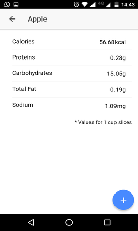

# MinhaDieta
My diet allows you to seek the detailed information of a food to assemble a diet with the individual characteristics obtaining a better result.

## Table of Contents
 - [Getting Started](#getting-started)
 - [Use Cases](#use-cases)
 - [App Preview](#app-preview)

## Getting Started
* Clone this repository: `git clone https://github.com/gamartins/minha-dieta.git`
* Run npm install from the project root.
* Install the ionic CLI ( `npm install -g ionic` )
* Configure the file `api.connection.data.ts`
* Run `ionic cordova run` in a terminal from the project root.

## Use Cases
* Nutrinfo Component - [ [Template](https://github.com/gamartins/minha-dieta/blob/master/src/components/nutrinfo-card/nutrinfo-card.html) | [Code](https://github.com/gamartins/minha-dieta/blob/master/src/components/nutrinfo-card/nutrinfo-card.ts) | [Tests](https://github.com/gamartins/minha-dieta/blob/master/src/components/nutrinfo-card/nutrinfo-card.spec.ts) ]
* FoodDetails Page - [ [Template](https://github.com/gamartins/minha-dieta/blob/master/src/pages/food-details/food-details.html) | [Code](https://github.com/gamartins/minha-dieta/blob/master/src/pages/food-details/food-details.ts) | [Tests](https://github.com/gamartins/minha-dieta/blob/master/src/pages/food-details/food-details.spec.ts) ]
* MealDetails Page - [ [Template](https://github.com/gamartins/minha-dieta/blob/master/src/pages/meal-details/meal-details.html) | [Code](https://github.com/gamartins/minha-dieta/blob/master/src/pages/meal-details/meal-details.ts) | [Tests](https://github.com/gamartins/minha-dieta/blob/master/src/pages/meal-details/meal-details.spec.ts) ]
* MealList Page - [ [Template](https://github.com/gamartins/minha-dieta/blob/master/src/pages/meal-list/meal-list.html) | [Code](https://github.com/gamartins/minha-dieta/blob/master/src/pages/meal-list/meal-list.ts) | [Tests](https://github.com/gamartins/minha-dieta/blob/master/src/pages/meal-list/meal-list.spec.ts) ]
* Search Page - [ [Template](https://github.com/gamartins/minha-dieta/blob/master/src/pages/search/search.html) | [Code](https://github.com/gamartins/minha-dieta/blob/master/src/pages/search/search.ts) | [Tests](https://github.com/gamartins/minha-dieta/blob/master/src/pages/search/search.spec.ts) ]

## App Preview
All app preview screenshots were taken by running `ionic serve --lab`.
* [FoodDetails Page](https://github.com/gamartins/minha-dieta/blob/master/src/pages/food-details/food-details.html)

* [MealDetails Page](https://github.com/gamartins/minha-dieta/blob/master/src/pages/meal-details/meal-details.html)

* [MealList Page](https://github.com/gamartins/minha-dieta/blob/master/src/pages/meal-list/meal-list.html)

* [Search Page](https://github.com/gamartins/minha-dieta/blob/master/src/pages/search/search.html)

* To see more images of the app, check out the [screenshots directory](https://github.com/gamartins/minha-dieta/tree/master/resources/screenshots)!

## Deploying
* Install the platform plugin `cordova platform add [android|ios]`
* Run `ionic cordova run [android|ios] --prod`
